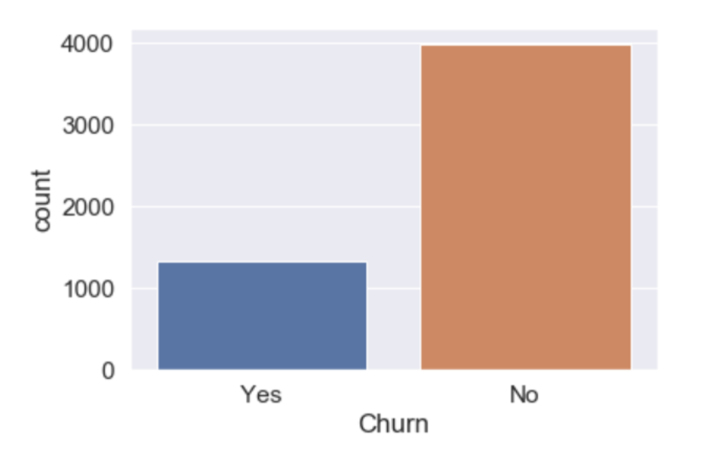
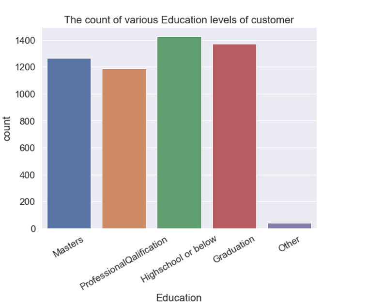
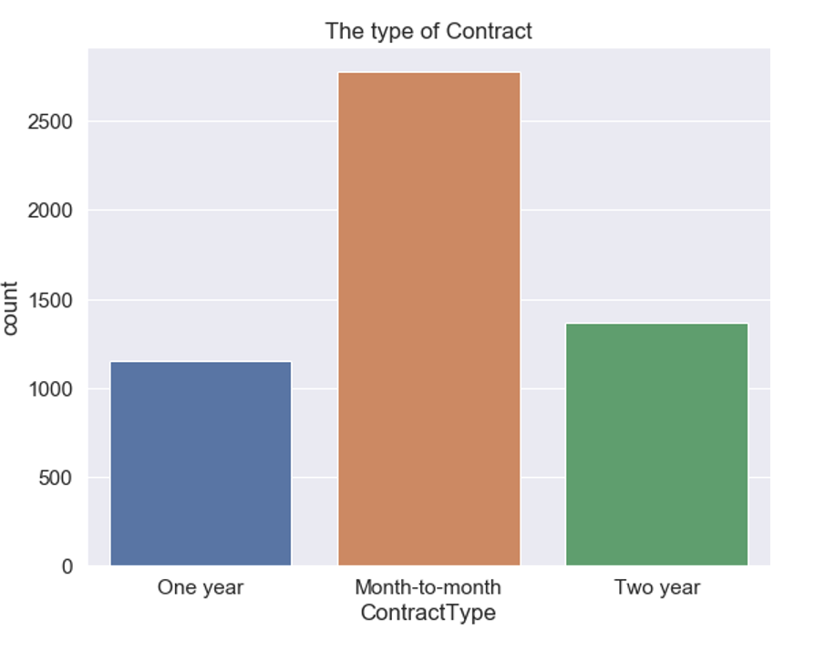
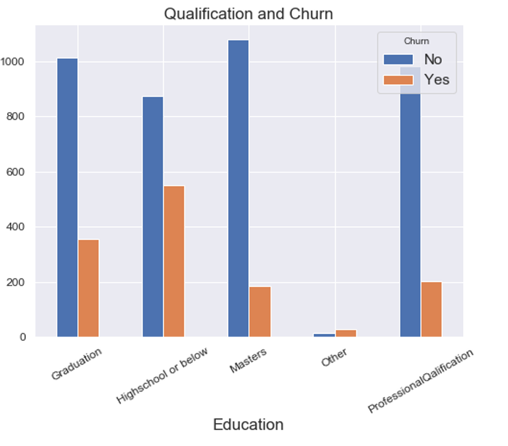
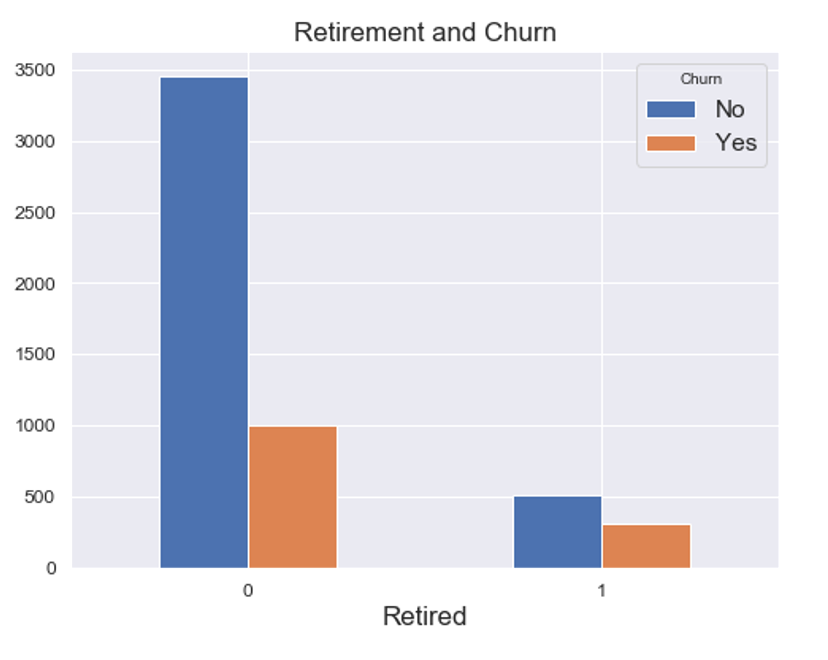
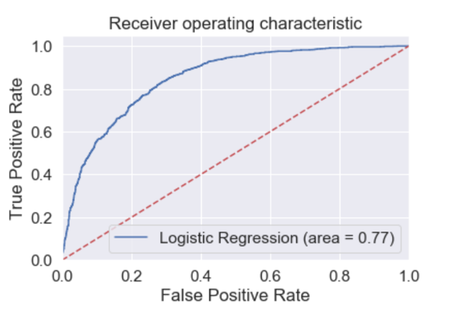
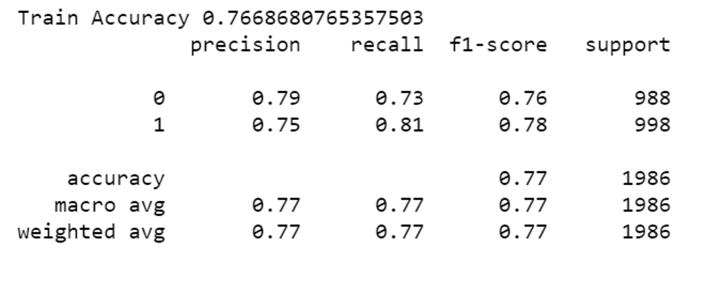
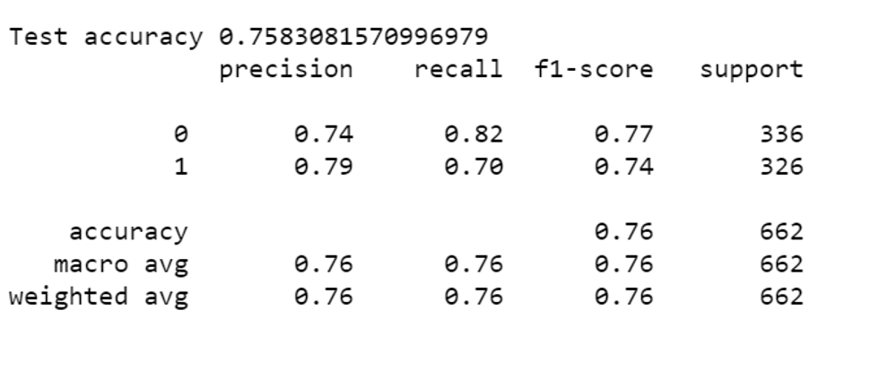

# Churn prediction for Telecom
## Problem Description
To predict the telecom customers who are likely to exit the contract and also to generate patterns of Churn and non-churn to assist the management to take appropriate decisions to limit churn.

# Data
The datasets are provided as cited below for the analysis:

1. Demographics Data: “Train_Demographics.csv” & “Test_Demographics.csv” These files consist of the demographic data of each customer, like HouseholdID, Country, State, Education, Gender etc.
2. Account Information: “Train_AccountInfo.csv” & “Test_AccountInfo.csv” These files consist of the customer account information with the telecom company, like CustomerID, DOE, Contract Type, Paymentmethod etc.
3. Data of ServicesOptedFor: “Train_ServicesOptedFor.csv” & “Test_ServicesOptedFor.csv” These files consist of the details about the services the customers signed for
4. Churn Data: “Train.csv” & “Test.csv” This “Train.csv” table contains the Customer churn details - CustomerID, Churn. This “Test.csv” contains only CustomerID (Not target attribute, which is to be predicted)
    5. Attributes Details: “AttributeInformation.docx” This has the details of attributes for the datasets cited above (1 to 4)
    
    
# Main Tasks
1.	Exploratory data analysis using visualizations in Jupyter notebook format.
2.	Built a model that predicts whether a customer churns or not from the company.

## Information about attributes:

Demographics Data : 
	•	HouseholdID : Each Household id
	
	• 	Country : Country. ( For this attribute, missing values   are denoted as “?”)
	
	•	State : State ( For this attribute, missing values are denoted as “?”)
	
	•	Retired : Whether retired
	
	•	HasPartner : Demographic information - whether the customer has partner ( 1-Yes; 2-No)
	
	•	HasDependents : Demographic information - whether the customer has dependents ( 1-Yes; 2-No)
	
	•	Education : Education qualification
	
	•	Gender : Demographic information – gender

Account Information :

	•	CustomerID : CustomerID
	
 	• 	BaseCharges : Customer account information (Charges for Base plan)
	
	•	DOC : Date of data collection
	
	•	TotalCharges : Customer account information( For this attribute,missing values are denoted as “MISSINGVAL” also)
	
	•	DOE : Date of entry as customer
	
	•	ElectronicBilling : Customer account information - whether electronic billing
	
	•	ContractType : Contract type ( For this attribute, missing values are denoted as “NA”)
	
	•	PaymentMethod : payment method

Data of ServicedOptedFor : 

	•	CustomerID : CustomerID
	
	•	TypeOfService : Service signed for    
	
	•	ServiceDetails : did the customer opted for that particular service

Churn Data : 	

	•	CustomerID : Customer ID
	
	•	Churn : Whether the customer churns  (Target)

**Plot of distribution of Y - churn or no churn**

It can be concluded that the data is Imbalanced as very few customers
out of the crowd Churn to different Network.

{width="4.322448600174978in"
height="2.8549595363079616in"}

### Highest education level of the customers is High school

### **Although school level education has most frequency, looking at the customers education in other levels shows that the most of the customers are highly educated and high school people are just 100 more than other categories which is not by a huge margin.**

{width="2.9in" height="2.6554286964129483in"}

## Most selling category of subscription is Monthly contract**

As expected most customers prefer Month-to-Month contract. It is also
interesting to see More people opting Two year plan rather than One year
plan.

{width="3.7655293088363955in"
height="2.9591830708661417in"}

### churn analysis of different education level shows that the Masters level people has the least churn rate 

{width="3.6076990376202973in"
height="3.253061023622047in"}

### 

### 

### 

### The churn rate is more with retired customers.

### {width="3.428571741032371in" height="2.7378094925634295in"}

### 

### Logistic Regression -- The most simple and straight forward algorithm's ROC curve is shown below.

### 

{width="4.008163823272091in"
height="2.9346336395450567in"}The following are the Metrics of the
Regression model on Train and Test Data respectively.

{width="4.302777777777778in"
height="1.6284722222222223in"}

{width="4.305555555555555in"
height="1.6388888888888888in"}

